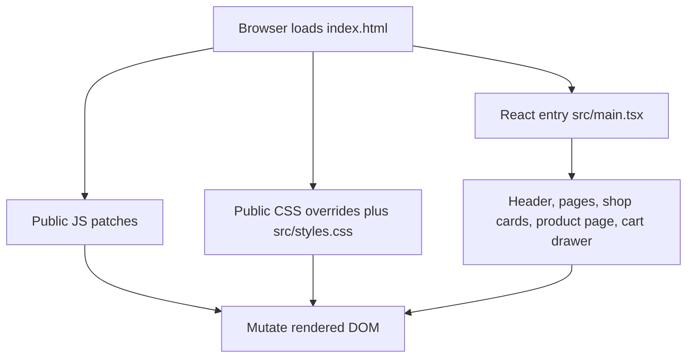
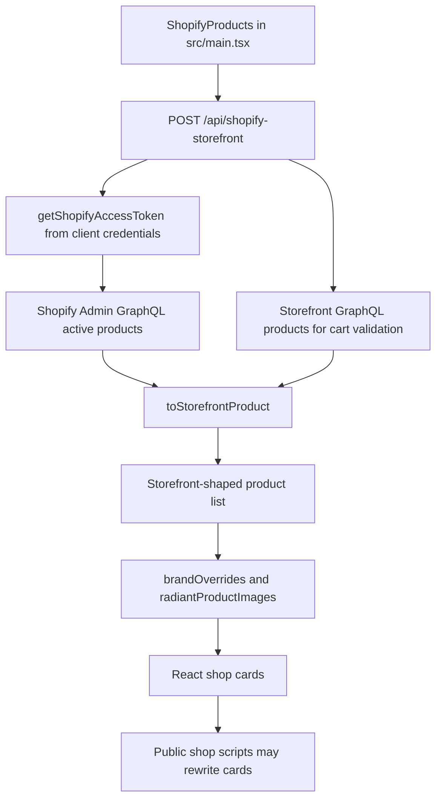
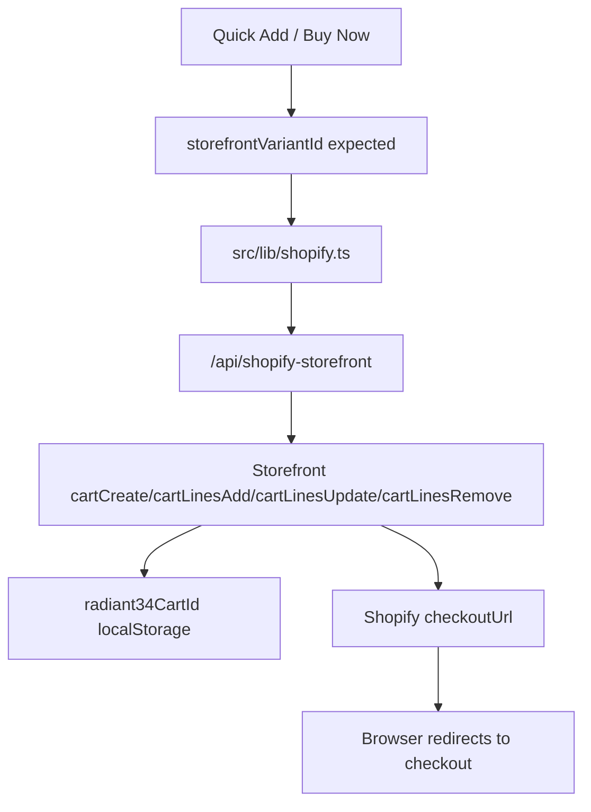
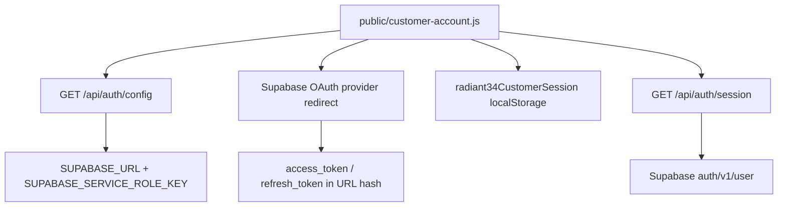
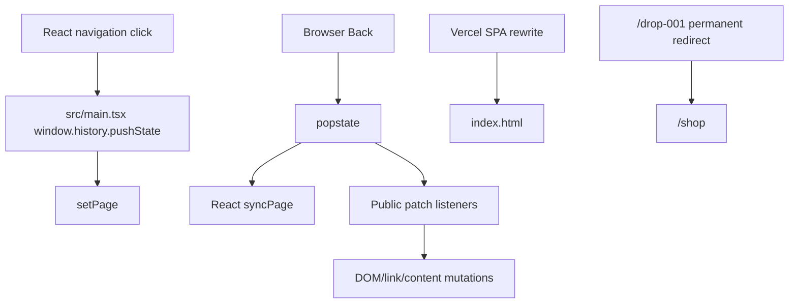

# Current Architecture

Commit audited: `75d9f6b0ff56bf1c61988cd9b2c03e59ca9d757e`.

## Browser Rendering Flow

## Shopify Product-Data Flow

## Cart And Checkout Flow

Current risk: `api/shopify-storefront.ts` can still derive `storefrontVariantId` from an Admin variant fallback when Storefront validation is unavailable.

## Authentication Flow

Google and Facebook are listed by `api/auth/config.ts`, but provider readiness depends on external Supabase configuration.

## Routing And History Flow

Current risk: routing ownership is split between React, public scripts, and Vercel redirects.

## Commercial Function Status

No item below is marked working without runtime evidence.

| Item | Status | Evidence |
| --- | --- | --- |
| Live homepage | UNVERIFIED | Build passed, production not manually tested. |
| Shop page | UNVERIFIED | React renders shop, public patches can hide/mutate UI. |
| Product-page loading | UNVERIFIED | Direct route code exists; production refresh not tested. |
| Product images | UNVERIFIED | Multiple source and post-render image overrides exist. |
| Product variants | UNVERIFIED | Admin and Storefront variant fields are mixed. |
| Add to Cart | UNVERIFIED | Storefront cart code exists; buttons may be hidden by CSS. |
| Cart drawer | UNVERIFIED | React drawer exists; not runtime tested. |
| Cart persistence | UNVERIFIED | `radiant34CartId` localStorage exists; expiry not runtime tested. |
| Quantity update | UNVERIFIED | Mutation exists; not runtime tested. |
| Remove item | UNVERIFIED | Mutation exists; not runtime tested. |
| Buy Now | UNVERIFIED | Uses Storefront cartCreate; no checkout redirect test performed. |
| Checkout redirect | UNVERIFIED | Checkout URL normalization exists; no live redirect confirmed. |
| Google sign-in | NOT CONFIGURED | Requires external Supabase/provider setup. |
| Facebook sign-in | NOT CONFIGURED | Requires external Supabase/provider setup. |
| Mobile menu | UNVERIFIED | React and public menu script both affect it. |
| Browser Back | UNVERIFIED | Multiple popstate handlers exist. |
| Direct product URL refresh | UNVERIFIED | SPA rewrite exists, production browser not tested. |
| Printful order routing | UNVERIFIED | No repo evidence proving routing. |
| Gelato order routing | UNVERIFIED | No repo evidence proving routing. |
