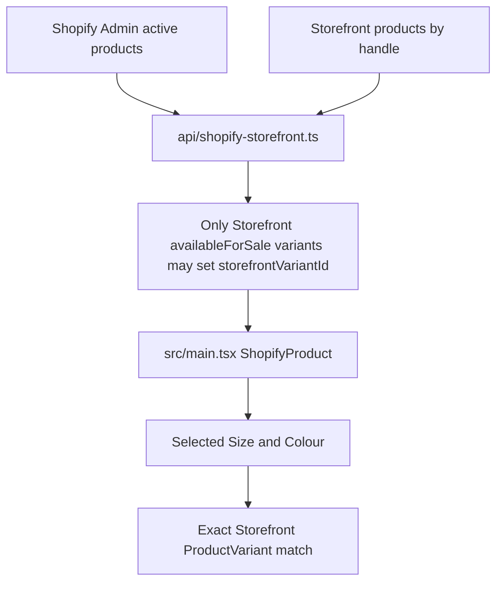
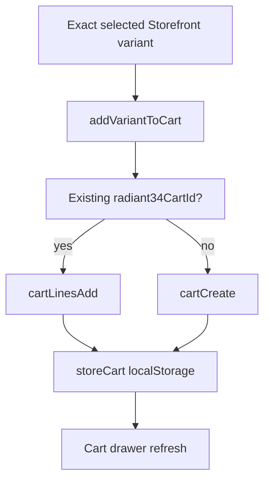
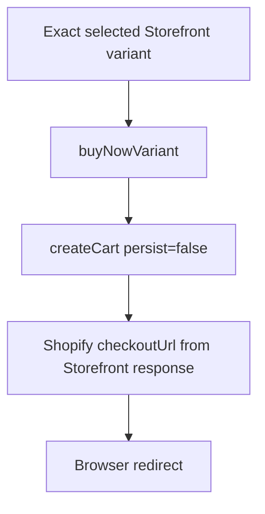
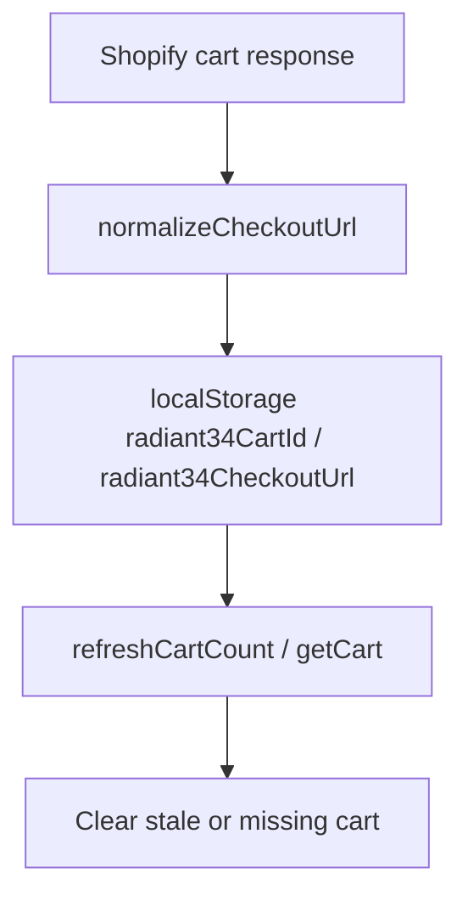

# Current Commerce Flow

Branch: `hotfix/cart-checkout-recovery-2026-08-03`

## Owners

- Product catalogue source: Shopify Admin product list, enriched by Storefront product/variant validation in `api/shopify-storefront.ts`.
- Product branding/media override source: `src/data/brandOverrides.ts` and `src/data/radiantProductImages.ts`.
- Cart API client: `src/lib/shopify.ts`.
- React product cards, product detail, cart drawer: `src/main.tsx`.
- Remaining public DOM scripts: still present and must be audited before this is production-ready. No new MutationObserver was added.

## Product Data To Variant

## Add To Cart

## Buy Now

## Cart Persistence

## Duplicate Or Conflicting Owners

- `public/shop-grid-integrity.css` previously hid React-owned purchase actions. That rule was removed.
- `public/shop-catalog-sync-v2.js`, `public/shopify-live-sync.js`, `public/shop-grid-normalizer.js`, and `public/product-page-content-fix.js` still run on the page and must be removed or migrated before production readiness can be claimed.
- `/api/shopify-storefront` still accepts GraphQL text from the frontend, but now rejects unsupported operations and invalid variant IDs. A stricter enum endpoint remains the better final architecture.
