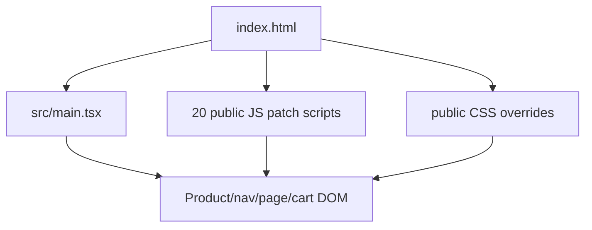
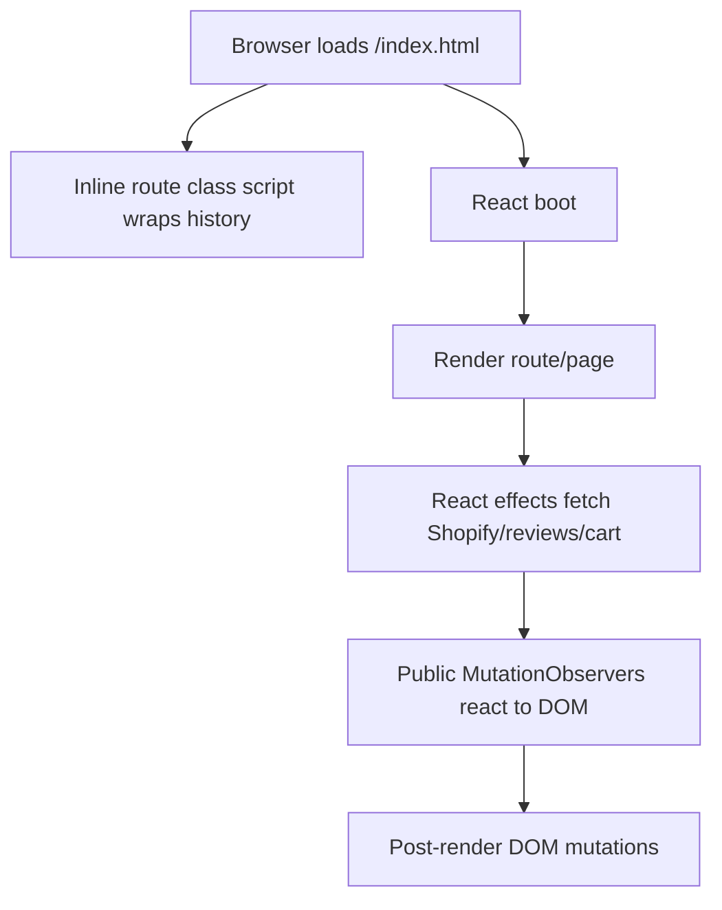
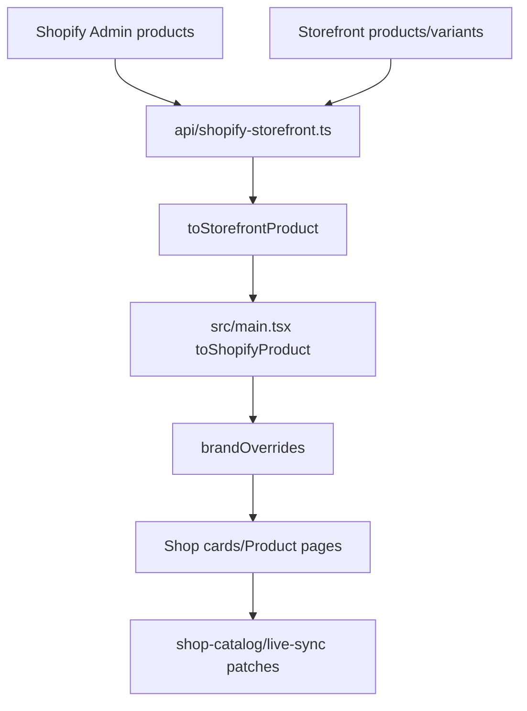
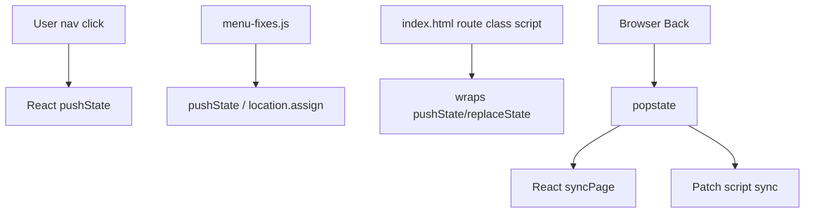
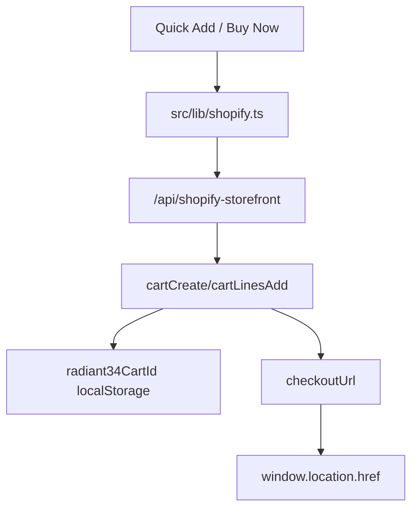
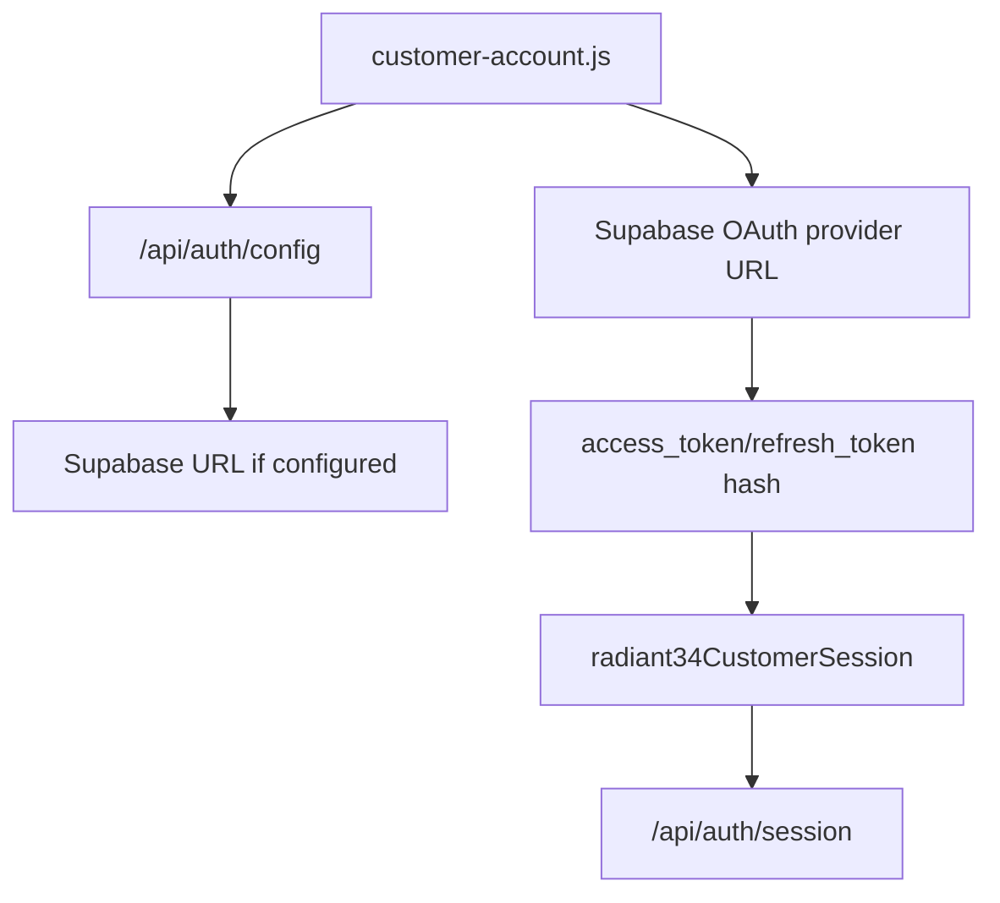

# Architecture Review

## Summary

The architecture is not production-grade for a commercial storefront yet. The core issue is not whether React renders; it is ownership. React, `index.html`, public patch scripts, public CSS, Vercel redirects and Shopify proxy code all participate in business-critical behavior.

## Ownership Diagrams

## Scores

| Area | Score | Explanation |
| --- | ---: | --- |
| Separation of concerns | 2/10 | `src/main.tsx` is a 1900+ line mixed application; public scripts also own UI. |
| Testability | 4/10 | Playwright exists but coverage is narrow and over-mocked; APIs lack unit tests. |
| Maintainability | 2/10 | Patch layer, duplicated product manifests and routing ownership make changes fragile. |
| Reliability | 3/10 | Build passes, but lint fails and commerce invariants are violated by code. |
| Change safety | 2/10 | Small UI changes can be overwritten by MutationObservers/CSS patches. |
| Ecommerce suitability | 3/10 | Shopify integration exists, but Admin/Storefront variant identity is unsafe. |

## Findings

See `R34-P0-001`, `R34-P1-001`, `R34-P1-002`, `R34-P2-001`.
